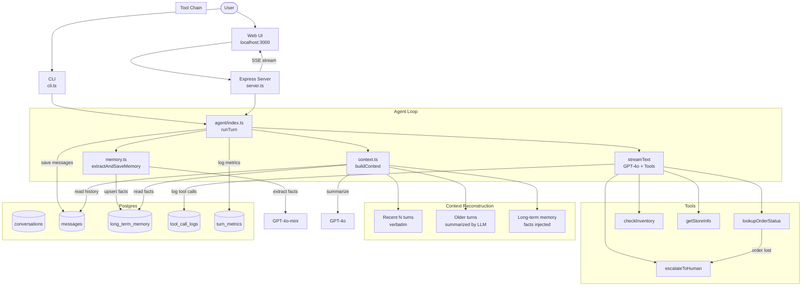

# Store Support Agent

A tool-using customer support agent with persistent memory for retail store management. Built with TypeScript, Vercel AI SDK v6, and Postgres.

## Demo

<!-- Upload demo.mp4 to a GitHub issue, copy the generated URL, and paste it below -->
<!-- GitHub auto-embeds videos from user-attachments URLs -->

## Architecture



## Features

- **Web UI** with real-time SSE streaming, markdown rendering, typing indicator, and tool call visualization
- **CLI interface** for terminal-based interaction
- **Multi-turn conversations** persisted in Postgres, resumable after restart
- **4 tools**: order lookup, inventory check, store info, human escalation
- **Tool chain**: lost order → automatic escalation with ticket creation
- **Long-term memory**: extracts customer facts (name, preferences) and recalls them in later turns
- **Context reconstruction**: summarizes old turns + injects recent turns verbatim + memory facts, all within a token budget
- **Graceful failure handling**: tool errors are caught, logged to Postgres, and the agent informs the user naturally
- **Per-turn metrics**: latency (ms) and token usage (input/output) logged to Postgres
- **OpenAPI documentation** via Swagger UI
- **Security hardening**: XSS escaping, UUID validation, message length limits, prompt injection guardrails

## Prerequisites

- [Node.js](https://nodejs.org/) 18+
- [Docker](https://www.docker.com/) & Docker Compose
- [OpenAI API key](https://platform.openai.com/api-keys)

## Quick Start

### 1. Clone and install

```bash
git clone https://github.com/narutoleaf/miniSupportAgent.git
cd miniSupportAgent
npm install
```

### 2. Configure environment

```bash
cp .env.example .env
```

Edit `.env` and set your OpenAI API key:

```
OPENAI_API_KEY=sk-proj-your-key-here
```

### 3. Set up Postgres

#### Option A: Using Docker (recommended)

```bash
docker compose up -d
```

This starts a Postgres 16 container and **automatically runs `schema.sql`** on first startup. No extra steps needed.

To verify:

```bash
docker exec store_agent_db pg_isready -U agent_user -d store_agent
```

#### Option B: Using your own Postgres

If you already have Postgres installed locally (no Docker), create the database and apply the schema manually:

```bash
# Create database and user
psql -U postgres -c "CREATE USER agent_user WITH PASSWORD 'agent_pass';"
psql -U postgres -c "CREATE DATABASE store_agent OWNER agent_user;"

# Apply schema
psql -U agent_user -d store_agent -f schema.sql
```

Then update `.env` to match your Postgres connection:

```
POSTGRES_HOST=localhost
POSTGRES_PORT=5432
POSTGRES_DB=store_agent
POSTGRES_USER=agent_user
POSTGRES_PASSWORD=agent_pass
```

#### Re-applying the schema

If you need to re-apply `schema.sql` at any point (all tables use `IF NOT EXISTS` so it's safe to re-run):

```bash
# Via npm script
npm run db:migrate

# Or directly with psql
psql -U agent_user -d store_agent -f schema.sql
```

### 4. Start the agent

```bash
# Web UI (recommended)
npm run dev:ui

# Then open http://localhost:3000
```

Or use CLI mode:

```bash
npm run dev
```

### 5. Chat with the agent

**Web UI** — open http://localhost:3000, click "+ New Conversation", and start chatting.

**CLI** — type `/new` to create a session, then type your messages.

Try these:
- `Check order ORD-003` — triggers tool chain (lookupOrderStatus → escalateToHuman)
- `My name is Alex and I prefer email` — extracts memory facts
- `Is SKU-100 in stock?` — checks inventory
- `What are the hours for store-hcm?` — gets store info

## Web UI

Open **http://localhost:3000** after starting with `npm run dev:ui`.

- **Sidebar**: create, select, and delete conversations (persisted across restarts)
- **Chat area**: streamed responses with markdown rendering and tool call indicators (spinner → checkmark)
- **Memory panel**: click "Memory" to view extracted customer facts
- **Failure simulation**: toggle to test graceful error handling
- **API docs**: http://localhost:3000/api-docs (Swagger UI)

## CLI Commands

| Command | Description |
|---------|-------------|
| `/new` | Start a new conversation |
| `/resume <id>` | Resume an existing conversation by UUID |
| `/fail on` | Enable tool failure simulation |
| `/fail off` | Disable tool failure simulation |
| `/quit` | Exit |

## API Endpoints

| Method | Endpoint | Description |
|--------|----------|-------------|
| `GET` | `/api/conversations` | List all conversations |
| `POST` | `/api/conversations` | Create a new conversation |
| `DELETE` | `/api/conversations/:id` | Delete a conversation and all its data |
| `GET` | `/api/conversations/:id/messages` | Get all messages in a conversation |
| `POST` | `/api/conversations/:id/chat` | Send message and receive SSE stream |
| `GET` | `/api/conversations/:id/memory` | Get extracted memory facts |
| `POST` | `/api/simulate-failure` | Toggle tool failure simulation |

Full OpenAPI spec available at `/api-docs`.

## Available Tools

| Tool | Description |
|------|-------------|
| `lookupOrderStatus` | Look up order status by order ID |
| `checkInventory` | Check product stock by SKU, optionally filtered by store |
| `getStoreInfo` | Get store address, phone, and opening hours |
| `escalateToHuman` | Create a support ticket and escalate to a human agent |

## Simulated Data

**Orders**: ORD-001 (delivered), ORD-002 (shipping), ORD-003 (lost), ORD-004 (processing)

**Products**: SKU-100 (White T-shirt, 45 in stock), SKU-101 (Jeans, 0), SKU-102 (Sneakers, 12), SKU-103 (Laptop backpack, 5), SKU-104 (Smartwatch, 3)

**Stores**: store-hcm (HCM), store-hn (Hanoi), store-dn (Da Nang)

## Eval Suite

Run the 11-case evaluation suite:

```bash
npm run eval
```

Tests cover: order lookup, tool chaining, inventory, store info, memory extraction, graceful failure, multi-turn context, multi-tool conversations, and context reconstruction with summarization.

## Database Schema

5 tables in `schema.sql` (auto-applied by Docker on first run):

| Table | Purpose |
|-------|---------|
| `conversations` | Session metadata |
| `messages` | Full message history per conversation (role, content, timestamps) |
| `long_term_memory` | Extracted customer facts as key/value pairs |
| `tool_call_logs` | Every tool call with input, output, error, and duration_ms |
| `turn_metrics` | Latency and token usage (input/output) per turn |

## Scripts

| Script | Description |
|--------|-------------|
| `npm run dev:ui` | Start the web UI + API server |
| `npm run dev` | Start the CLI agent |
| `npm run eval` | Run the eval suite (11 test cases) |
| `npm run build` | Compile TypeScript to `dist/` |
| `npm start` | Run compiled CLI agent |
| `npm run db:migrate` | Apply `schema.sql` to Postgres manually |
| `npm run typecheck` | Run TypeScript type checking |

## Security

- All SQL queries use parameterized placeholders (no string concatenation)
- User-controlled data is HTML-escaped before DOM insertion (XSS prevention)
- Markdown output sanitized via DOMPurify
- Route parameters validated as UUID format
- Message length capped at 2000 characters, request body limited to 16kb
- System prompt includes guardrails against prompt injection and role manipulation
- Memory facts explicitly labeled as data (not instructions) in the prompt
