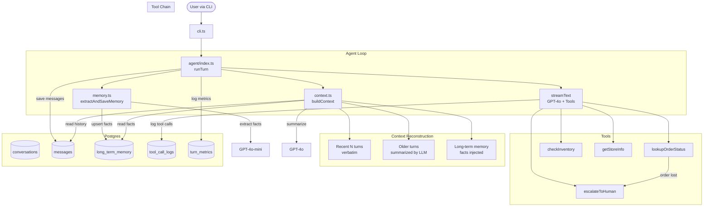

# Store Support Agent

A tool-using customer support agent with persistent memory for retail store management. Built with TypeScript, Vercel AI SDK, and Postgres.

## Architecture



## Features

- **Multi-turn conversations** persisted in Postgres, resumable after restart
- **4 tools**: order lookup, inventory check, store info, human escalation
- **Tool chain**: lost order → automatic escalation with ticket creation
- **Long-term memory**: extracts customer facts (name, preferences) and recalls them in later turns
- **Context reconstruction**: summarizes old turns + injects recent turns verbatim + memory facts, all within a token budget
- **Graceful failure handling**: tool errors are caught, logged, and the agent informs the user naturally
- **Per-turn metrics**: latency (ms) and token usage (input/output) logged to Postgres

## Prerequisites

- Node.js 18+
- Docker & Docker Compose
- OpenAI API key

## Setup

1. **Clone and install**

```bash
git clone <repo-url> && cd store-support-agent
npm install
```

2. **Configure environment**

```bash
cp .env.example .env
# Edit .env and add your OPENAI_API_KEY
```

3. **Start Postgres**

```bash
docker compose up -d
```

The schema is auto-applied on first run via `docker-entrypoint-initdb.d`.

4. **Start the agent**

```bash
npm run dev
```

## CLI Commands

| Command | Description |
|---------|-------------|
| `/new` | Start a new conversation |
| `/resume <id>` | Resume an existing conversation by UUID |
| `/fail on` | Enable tool failure simulation |
| `/fail off` | Disable tool failure simulation |
| `/quit` | Exit |

## Example Session

```
==================================================
  Store Support Agent
==================================================

[no session] You: /new
New session created: a1b2c3d4-...

[a1b2c3d4] You: My name is David, I prefer email for contact.
Assistant: Chào David! Cảm ơn bạn đã chia sẻ...

[a1b2c3d4] You: Check order ORD-003
Assistant: Đơn hàng ORD-003 đã bị thất lạc. Tôi đã tạo phiếu hỗ trợ TK-...

[a1b2c3d4] You: /fail on
Simulate failure: ON — tool calls will fail.

[a1b2c3d4] You: Check order ORD-001
Assistant: Xin lỗi, hệ thống tra cứu đơn hàng hiện đang gặp sự cố...
```

## Available Tools

| Tool | Description |
|------|-------------|
| `lookupOrderStatus` | Look up order status by order ID |
| `checkInventory` | Check product stock by SKU, optionally filtered by store |
| `getStoreInfo` | Get store address, phone, and opening hours |
| `escalateToHuman` | Create a support ticket and escalate to a human agent |

## Simulated Data

**Orders**: ORD-001 (delivered), ORD-002 (shipping), ORD-003 (lost), ORD-004 (processing)

**Products**: SKU-100 (White T-shirt, 45 in stock), SKU-101 (Jeans, 0), SKU-102 (Sneakers, 12), SKU-103 (Laptop backpack, 5), SKU-104 (Smartwatch, 3)

**Stores**: store-hcm (HCM), store-hn (Hanoi), store-dn (Da Nang)

## Eval Suite

Run the 10-case evaluation suite:

```bash
npm run eval
```

Tests cover: order lookup, tool chaining, inventory, store info, memory extraction, graceful failure, multi-turn context, and multi-tool conversations.

## Database Schema

5 tables in `schema.sql`:

- `conversations` — session metadata
- `messages` — full message history per conversation
- `long_term_memory` — extracted customer facts (key/value)
- `tool_call_logs` — every tool call with input, output, error, and duration
- `turn_metrics` — latency and token usage per turn

## Scripts

| Script | Description |
|--------|-------------|
| `npm run dev` | Start the CLI agent (ts-node) |
| `npm run build` | Compile TypeScript to `dist/` |
| `npm start` | Run compiled agent |
| `npm run eval` | Run eval suite |
| `npm run db:migrate` | Apply schema to Postgres manually |
